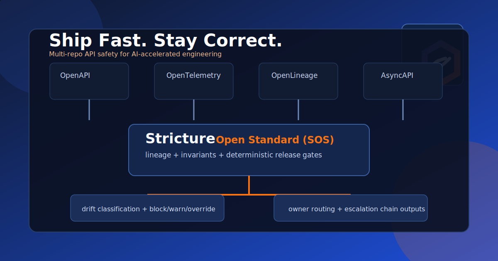

# Stricture



## Ship Fast. Stay Correct.

**Stricture is a lineage-first drift control and architectural enforcement layer for API ecosystems.**

It helps teams ship quickly without losing system integrity by making data provenance,
architecture invariants, and release policies **semantic + deterministic**.

## Why Stricture

### Catch What Traditional Linters Miss

- Field-level source provenance drift across services
- Architecture breaks that jump boundaries between systems
- Silent source-version and as-of mismatches from upstream providers
- Weak release decisions without ownership or escalation context

### Built For AI-Accelerated Development

- LLMs can generate code quickly; Stricture adds deterministic release gates
- Semantic annotations become executable checks, not stale docs
- Overlays let teams reuse metadata across OpenAPI, OpenTelemetry,
  OpenLineage, and AsyncAPI without duplicate work

## Core Capabilities

- Lineage annotations per output field
- Service-level business flow tiers (`'strict:flows'`, `systems[].flows`)
- Drift classification with severity and deterministic ordering
- Architecture invariant enforcement
- Warn/block mode and time-bounded overrides
- Source system version and as-of freshness controls
- Owner and escalation chain resolution
- Policy URL/server distribution (`strict:policy_url`, `strict:server_url`)
- Export/report pipelines for CI and governance workflows

Reference handle namespace in docs/tooling UX uses `strict:*` (for example
`strict:source`, `strict:systems[]`). Source-comment parser syntax remains
`stricture-source` / `stricture-lineage-override`.

## Quickstart

```bash
# Build the CLI
make build

# Run linting (default command)
./bin/stricture lint .

# Export lineage artifact
./bin/stricture lineage-export --out tests/lineage/current.json .

# Diff lineage artifacts
./bin/stricture lineage-diff \
  --base tests/lineage/baseline.json \
  --head tests/lineage/current.json \
  --mode block
```

## CLI Commands

```bash
stricture list-rules
stricture explain --rule ARCH-dependency-direction
stricture inspect-lineage path/to/file.go
stricture lineage-escalate --service ServiceY --artifact tests/lineage/current.json --systems docs/config-examples/lineage-systems.yml
```

## Testing And CI

Contributor and CI commands are documented in [TESTING.md](TESTING.md).

## Open Standard (SOS)

Stricture is being formalized as an open standard.

- Charter: [SPEC-CHARTER.md](SPEC-CHARTER.md)
- Draft spec: [spec/0.1-draft.md](spec/0.1-draft.md)
- Lineage annotations: [docs/data-lineage-annotations.md](docs/data-lineage-annotations.md)

## Documentation Map

- Product spec: [docs/product-spec.md](docs/product-spec.md)
- Product roadmap: [docs/ROADMAP.md](docs/ROADMAP.md)
- Lineage automation spec: [docs/LINEAGE-AUTOMATION-SPEC.md](docs/LINEAGE-AUTOMATION-SPEC.md)
- Policy pack spec (draft): [docs/POLICY-PACK-SPEC.md](docs/POLICY-PACK-SPEC.md)
- Policy CLI contract (draft): [docs/POLICY-CLI-CONTRACT.md](docs/POLICY-CLI-CONTRACT.md)
- Stricture Helper draft spec: [docs/helper/SPEC.md](docs/helper/SPEC.md)
- Stricture Server spec: [docs/server/SPEC.md](docs/server/SPEC.md)
- Stricture Server storage/auth design: [docs/server/STORAGE.md](docs/server/STORAGE.md)
- Technical spec: [docs/tech-spec.md](docs/tech-spec.md)
- Invariants: [docs/INVARIANTS.md](docs/INVARIANTS.md)
- Lineage annotations: [docs/data-lineage-annotations.md](docs/data-lineage-annotations.md)
- Testing and quality gates: [TESTING.md](TESTING.md)
- Deploying site: [DEPLOY.md](DEPLOY.md)

## Website

- Landing page: https://stricture-lint.com/
- With AI: https://stricture-lint.com/with-ai
- Open Standard: https://stricture-lint.com/open-standard
- Live demo: https://stricture-lint.com/demo

## License

- Implementation (CLI, engine, adapters, scripts): [AGPL-3.0](LICENSE)
- Open Standard spec and schemas: [CC BY 4.0](LICENSES/CC-BY-4.0.md)
- Path-level mapping: [LICENSES.md](LICENSES.md)
